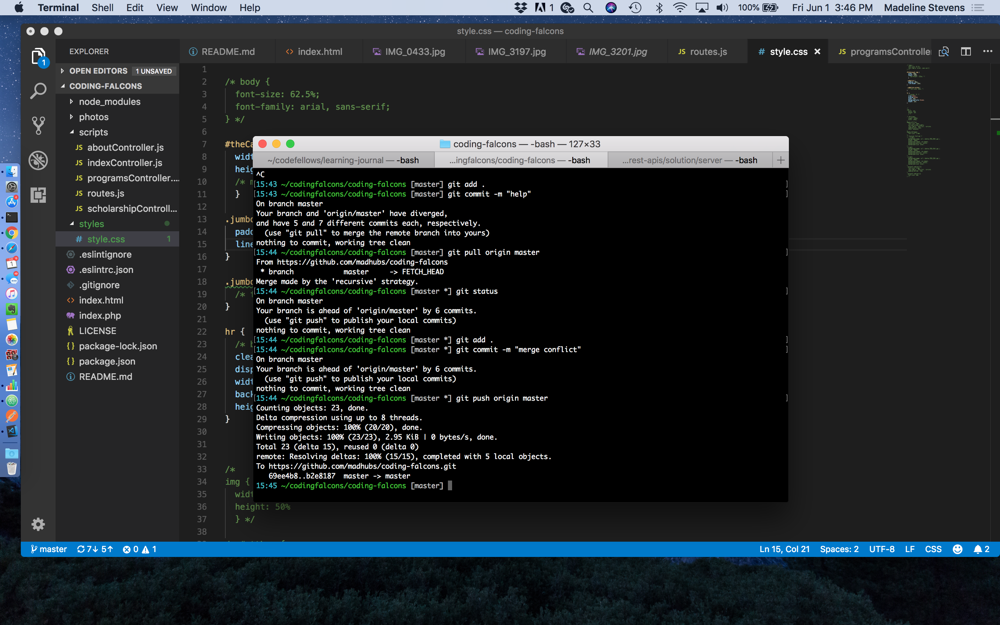
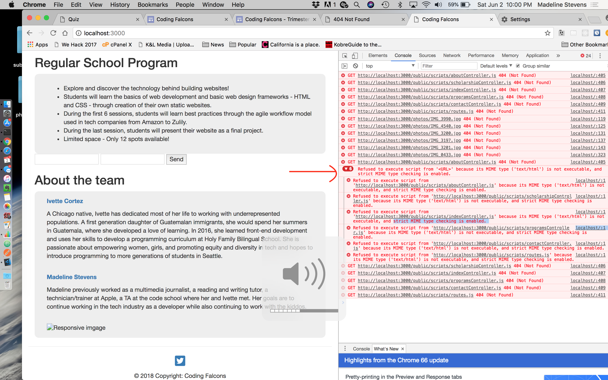

### Welcome to Coding Falcons! This time with react!!!

Coding Falcons is a school and summer coding program for students 5-8th grade. Ivette Cortez and Madeline Stevens run the program and hope to expand throughout White Center and the rest of South Seattle. This single page app is meant for relaying information to the parents and students interested in our coding programs.

### Heroku site:

http://codingfalcons.herokuapp.com

### Table of Contents

- [Initial Setup](#preview)
- [Bootstrap and Heroku setup](#bootstrap)
- [Resources](#resources)
- [ARIA](#ARIA)

### Initial Setup:

#### Preview

Within terminal, in the root of this project folder type:

```
live-server
```

After adding server.js file and installing express and specifying 'PORT 3000' type this in terminal:

```
nodemon
```

#### packages

npm init- to create package.json
npm install- to create nodemodules

needed to update hoek dependency in node:

```
npm update && npm install
```

#### CDNs (aka- libraries)

- page.js
- jquery
- bootstrap
- Font Awesome ( twitter- <i class="fab fa-twitter-square"></i>)

### Bootstrap and Heroku setup:

#### Bootstrap:

Adding bootstrap components (resource- https://www.youtube.com/watch?v=gqOEoUR5RHg)

To incorporate bootstrap I added two things to my index.html and i immediately saw a change in my chrome browser after right clicking/open in browser:
At the top within my my style sheets section:

```html
<link rel="stylesheet" href="https://maxcdn.bootstrapcdn.com/bootstrap/3.3.7/css/bootstrap.min.css" integrity="sha384-BVYiiSIFeK1dGmJRAkycuHAHRg32OmUcww7on3RYdg4Va+PmSTsz/K68vbdEjh4u" crossorigin="anonymous">
```

At the bottom within my CDN scripts section:

```html
    <script src="https://maxcdn.bootstrapcdn.com/bootstrap/3.3.7/js/bootstrap.min.js" integrity="sha384-Tc5IQib027qvyjSMfHjOMaLkfuWVxZxUPnCJA7l2mCWNIpG9mGCD8wGNIcPD7Txa" crossorigin="anonymous"></script>
```

#### Heroku:

Setting up heroku environment.

Attempting to use the php fix again (resource- https://www.youtube.com/watch?v=IVvU9JF6o8s):

```php
<?php header( 'Location: /index.html' ) ; ?>
```

Ran into the issue of jquery not being recognized despite the CDN's script at the bottom of index.html. I had to add this into .eslintrc:

```
  "env": {
    "browser": true,
    "jquery": true,
    "node": true,
    "es6": true
  },
```

### Fixed

#### A merge conflict due to editing the readme on github, that seemed to all of a sudden fix itself:



#### MIME chrome error message:

There was missing a semicolon in the server.js file, also had multiple scripts for bootstrap and jquery.


#### Following error in chrome browser window:

```
The requested URL /about was not found on this server.
```

The issue was that I had used that php trick to attempt to host a simple html/css app (not sure why it wouldn't initally work still) and I did not have _ just _ the following, I thought I had to be explicit about each route in server.js as well as route.js:

In server.js:

```
app.get('/*', (req, res) => {
  console.log("__REQUEST__ : ", req);
  console.log("__RESPONSE__ : ", res);
  res.sendFile('index.html', {root: './public'});
});
```

Getting rid of the above solved my problem locally on localhost:3000 but not on heroku.

#### Hiding tab content on home page:

The following code in routes.js will hide tab content on page load but if you refresh within tab content this code also tells your page to only show home. So I still need to figure out a solution.

// $(document).ready(function() {
// $('#about').hide();
// $('#scholarships').hide();
// $('#programs').hide();
// $('#contact').hide();
// $('#home').show();
// });

#### After creating react repo in finder, cloning files from github, moving them into react folder in finder, and attempting to git init and push I get this error:

```
fatal: 'origin' does not appear to be a git repository
```

Solution:
You did this incorrectly! So now you need to actually create a repo on github and stop trying to create one locally and push it! ;)

### ARIA

#### ARIA attributes added to html attributes:

1.  Added aria-label for a fontawesome Twitter icon in my footer:

```html
<a href="https://twitter.com/_madtweets" target="_blank" aria-label="Twitter"><i class="fab fa-twitter-square fa-2x"></i></a>
```

2.  Added aria-required for each "contact us" form text field:

```html
<input type="email" class="form-control" name="replyto" value="" placeholder="E-mail" aria-required="true">
```

3.  Added aria-label for each "contact us" form text field:

```html
<input type="text" class="form-control" name="name" placeholder="Name" aria-label="Form, empty name field" aria-required="true">
```

4.  Don't use heading mark up on text that isn't actually a heading:
    Used to be:

     <h4><strong>Ask us anything!</strong></h4>
    ARIA change:
     <p><strong>Ask us anything!</strong></p>

5.  Adding meaningful alt text to images, instead of the default bootcamp provides:
    Used to be:

```html

```

Changed to:

```html

```

6.  Adding aria-labels to image carousel left/right pointers:

```html
<a class="left carousel-control" href="#theCarousel" data-slide="prev">
  <span class="glyphicon glyphicon-chevron-left" aria-label="click to go to left carousel image"></span>
</a>
```

### REACT notes

- Using Udemy's MERN stack front to back tutorial (Thank you Wade for the longin share)- https://www.udemy.com/mern-stack-front-to-back/learn/v4/t/lecture/10055142?start=0

- Udemy devconnector project github reop: https://github.com/bradtraversy/devconnector

1.  Cloned starter files from original coding falcons.
2.  npm i...express, babel, body-parser, jsonwebtoken, mongoose, passport, passport-jwt, validator
3.  Set up server.js with a port
4.  nodemon
5.  Test port 5000 in browser
6.  Added "server": "nodemon server.js" to package.json but may be redundant of "watch": "nodemon server.js"
7.  Adding mlab mongodb string to config folder/keys file
8.  adding routes folder > api folder > profile.js (for bio, experience, social network links), users.js (for anything auth related- username, password) and a posts.js
9.  Adding app.use for each profile.js, users.js, posts.js within server.js
10. Getting this error after running nodemon but that's because we haven't actually added the router to the three routes files:``` TypeError: Router.use() requires a middleware function but got a Object
11. I'm getting this error: Error: Invalid schema, expected `mongodb` or `mongodb+srv`. But localhost:5000 still works.
12. Now I'm testing each route in chome by manually typing this into browser, and we are getting our json response in the browser window (message: profile works): http://localhost:5000/api/posts/test
13. Adding a models folder > User.js to then create the user schema (to include name, email, password, gravatar avatar and a date)
14. Added the logic for findOne email in Users.js. So if email already exists in mlabs database, give an error, if it does not already exist go ahead and create an account with that email. This includes the schema for a new user.
15. Install the gravatar module with npm install gravatar.
16. After installing I got this error: npm WARN coding_falcons@1.0.0 No repository field.
17.  

And fixed this by including this in package.json:

```json
 "repository": {
  "type": "git",
  "url": "https://github.com/madhubs/coding-falcons-react"
}
```

### Resources

Bootstrap in general (carousel, etc)- https://www.youtube.com/watch?v=gqOEoUR5RHg  
Bootstrap carousel (deeper dive)- https://www.youtube.com/watch?v=R0nkkXkrby0  
Rounding corners for about the team- https://codepen.io/Madeline206/pen/JZPmMY?editors=1100  
Resizing jumbotron- https://www.codecademy.com/en/forum_questions/5398ac97282ae39e8d000be6  
Bootstrap contact us- https://bootsnipp.com/snippets/featured/contact-us  
Bootstrap footer- https://mdbootstrap.com/components/bootstrap-footer/  
Formspree for contact us- https://formspree.io  
routing (showing/hiding index.html content)- https://github.com/ejdelrio/11-spa_routing/tree/anthony-eddie/starter-code
`
